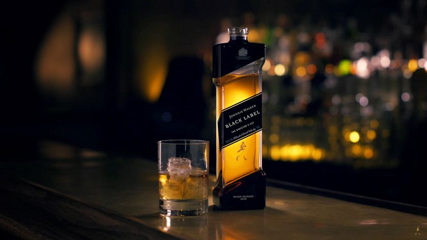
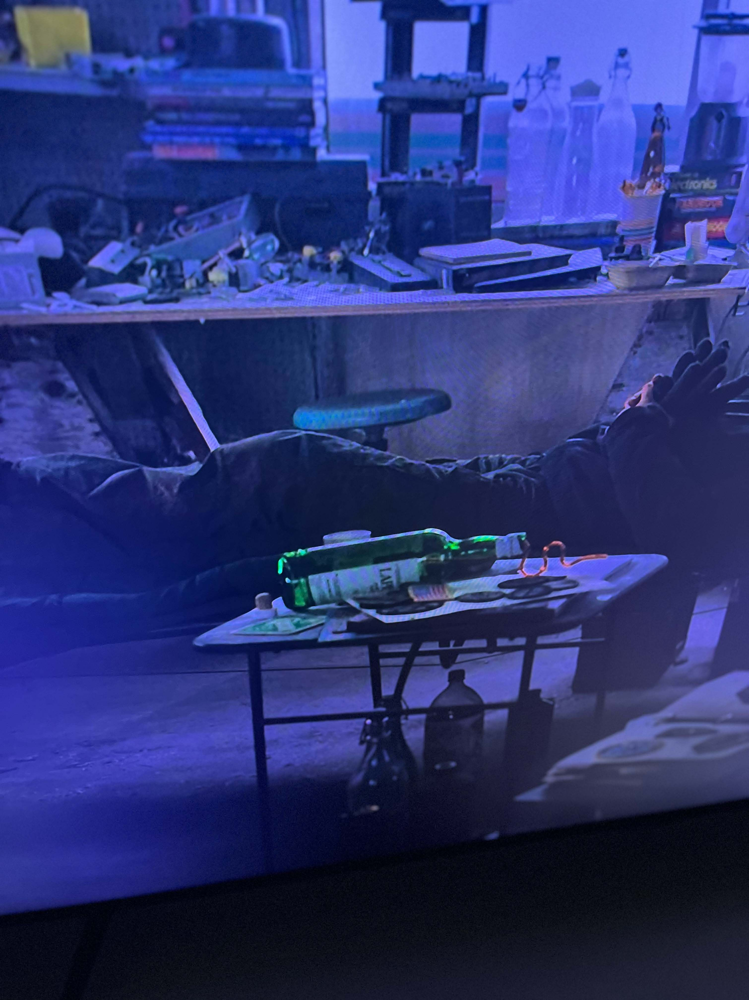
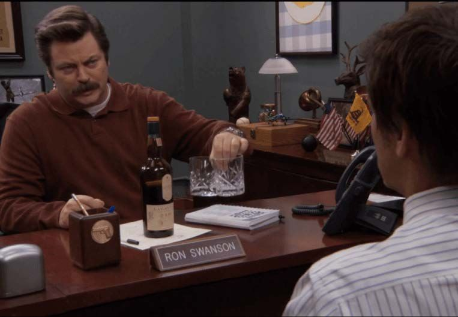
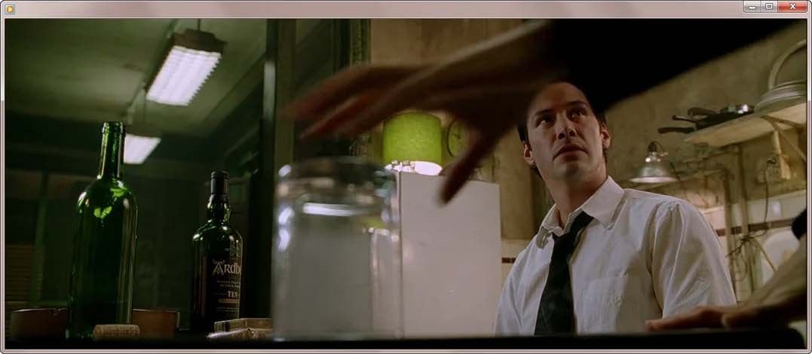
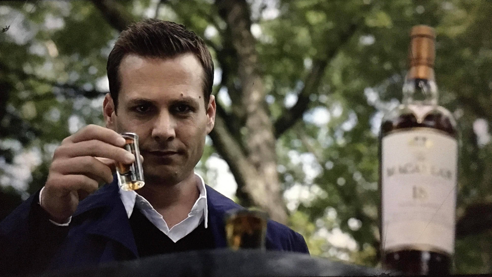

# Movie Whisky Scene Candidates

These images are candidates for manual review before creating image-only or image+text queries.

Source page: <https://spiritory.com/blog/whisky-in-movies-iconic-bottles-and-film-appearances-en>

Copyright note: Downloaded for local research/demo review only. Keep source URLs; do not redistribute or commit image assets unless rights are confirmed.

Each section shows the movie/TV candidate first, followed by the closest cropped product images from our extracted catalogue. Catalogue products are grouped when they share the same extracted crop.

## msq001 - Skyfall / Macallan 1962 Fine & Rare

Catalogue has Macallan products but not the exact 1962 Fine & Rare bottle.

### Movie / TV Image

### Catalogue Crop Candidates

<strong>p0243-the-macallan-10-year-old</strong> - THE MACALLAN 10-YEAR-OLD <strong>p0243-the-macallan-fine-oak-10-year-old</strong> - THE MACALLAN FINE OAK 10-YEAR-OLD

<strong>p0244-the-macallan-25-year-old</strong> - THE MACALLAN 25-YEAR-OLD <strong>p0244-the-macallan-30-year-old</strong> - THE MACALLAN 30-YEAR-OLD

## msq002 - Lost in Translation / Suntory Hibiki 17

Good candidate because the exact Hibiki 17 product exists in the catalogue.

### Movie / TV Image

### Catalogue Crop Candidates

<strong>p0334-suntory-hibiki-17-year-old</strong> - SUNTORY HIBIKI 17-YEAR-OLD <strong>p0334-suntory-hibiki-30-year-old</strong> - SUNTORY HIBIKI 30-YEAR-OLD

## msq003 - Blade Runner / Johnnie Walker Black Label

Good brand-family query candidate; movie bottle design may differ from normal catalogue bottle.

### Movie / TV Image

### Catalogue Crop Candidates

<strong>p0208-johnnie-walker-black-label</strong> - JOHNNIE WALKER BLACK LABEL <strong>p0208-johnnie-walker-green-label</strong> - JOHNNIE WALKER GREEN LABEL

<strong>p0209-johnnie-walker-gold-label</strong> - JOHNNIE WALKER GOLD LABEL <strong>p0209-johnnie-walker-blue-label</strong> - JOHNNIE WALKER BLUE LABEL

## msq004 - John Wick / Blanton's Bourbon

Good exact-product visual query candidate.

### Movie / TV Image

### Catalogue Crop Candidates

<strong>p0057-blanton-s-single-barrel</strong> - BLANTON’S SINGLE BARREL

## msq005 - The Shining / Jack Daniel's Old No. 7

Likely useful for brand recognition, though scene framing may make bottle details harder.

### Movie / TV Image

### Catalogue Crop Candidates

<strong>p0199-jack-daniel-s-old-no-7</strong> - JACK DANIEL’S OLD NO. 7 <strong>p0199-jack-daniel-s-single-barrel</strong> - JACK DANIEL’S SINGLE BARREL

## msq006 - The Last of Us / Laphroaig

Good image+text candidate if the text asks for smoky, peaty, or stronger Laphroaig.

### Movie / TV Image

### Catalogue Crop Candidates

<strong>p0228-laphroaig10-year-old</strong> - LAPHROAIG10-YEAR-OLD <strong>p0228-laphroaig-10-year-old-cask-strength</strong> - LAPHROAIG 10-YEAR-OLD CASK STRENGTH

<strong>p0229-laphroaig-quarter-cask</strong> - LAPHROAIG QUARTER CASK <strong>p0229-laphroaig-25-year-old</strong> - LAPHROAIG 25-YEAR-OLD

## msq007 - 28 Days Later / Parks and Recreation / Lagavulin

Good brand-family query candidate for Lagavulin.

### Movie / TV Image

### Catalogue Crop Candidates

<strong>p0224-lagavulin-16-year-old</strong> - LAGAVULIN 16-YEAR-OLD <strong>p0224-lagavulin-12-year-old</strong> - LAGAVULIN 12-YEAR-OLD

<strong>p0225-lagavulin-distillers-edition</strong> - LAGAVULIN DISTILLERS EDITION <strong>p0225-lagavulin-21-year-old</strong> - LAGAVULIN 21-YEAR-OLD

## msq008 - Constantine / Ardbeg 10

Good image+text candidate for asking for gentler, stronger, or sherried Ardbeg variants.

### Movie / TV Image

### Catalogue Crop Candidates

<strong>p0021-ardbeg-10-year-old</strong> - ARDBEG 10-YEAR-OLD <strong>p0021-ardbeg-airigh-nam-beist</strong> - ARDBEG AIRIGH NAM BEIST

<strong>p0022-ardbeg-blasda</strong> - ARDBEG BLASDA <strong>p0022-ardbeg-uigeadail</strong> - ARDBEG UIGEADAIL

## msq009 - Suits / Macallan 18

Catalogue has Macallan products but not Macallan 18; better as a brand-family query.

### Movie / TV Image

### Catalogue Crop Candidates

<strong>p0243-the-macallan-10-year-old</strong> - THE MACALLAN 10-YEAR-OLD <strong>p0243-the-macallan-fine-oak-10-year-old</strong> - THE MACALLAN FINE OAK 10-YEAR-OLD

<strong>p0244-the-macallan-25-year-old</strong> - THE MACALLAN 25-YEAR-OLD <strong>p0244-the-macallan-30-year-old</strong> - THE MACALLAN 30-YEAR-OLD

## msq010 - Mad Men / Canadian Club

Good brand-family candidate; some parsed Canadian Club brand fields are noisy.

### Movie / TV Image

### Catalogue Crop Candidates

<strong>p0074-canadian-club-reserve</strong> - CANADIAN CLUB RESERVE <strong>p0074-canadian-club-6-year-old-100-proof</strong> - CANADIAN CLUB 6-YEAR-OLD 100 PROOF

<strong>p0075-canadian-club-premium</strong> - CANADIAN CLUB PREMIUM <strong>p0075-canadian-club-classic</strong> - CANADIAN CLUB CLASSIC

## msq011 - The West Wing / Johnnie Walker Blue Label

Good candidate for premium-version or same-brand multimodal queries.

### Movie / TV Image

### Catalogue Crop Candidates

<strong>p0209-johnnie-walker-blue-label</strong> - JOHNNIE WALKER BLUE LABEL <strong>p0209-johnnie-walker-gold-label</strong> - JOHNNIE WALKER GOLD LABEL

<strong>p0208-johnnie-walker-black-label</strong> - JOHNNIE WALKER BLACK LABEL <strong>p0208-johnnie-walker-green-label</strong> - JOHNNIE WALKER GREEN LABEL

