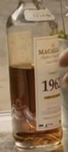
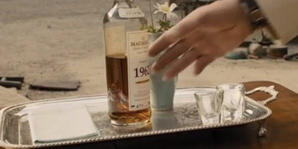
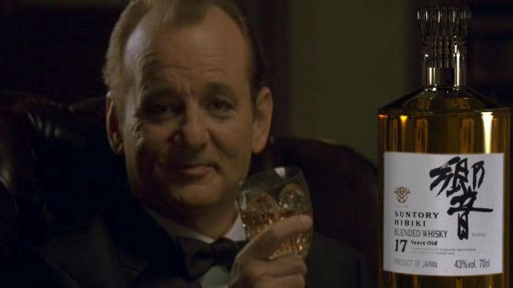
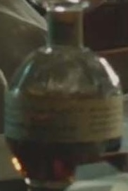
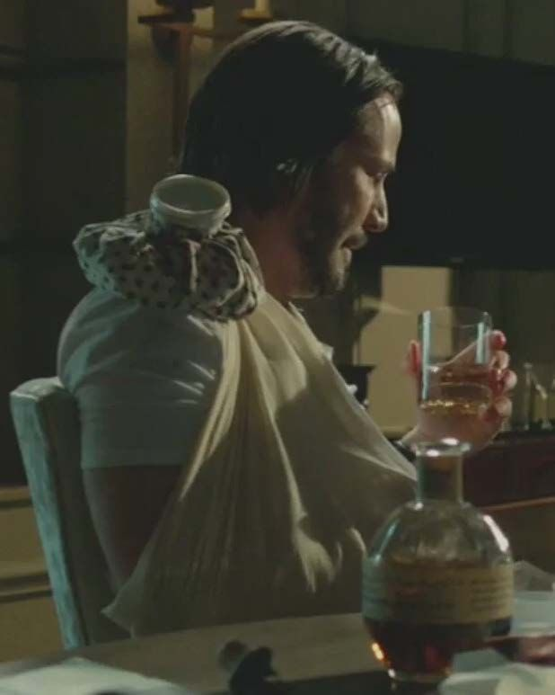
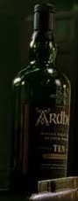
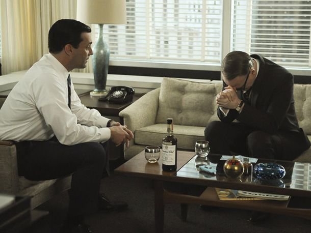
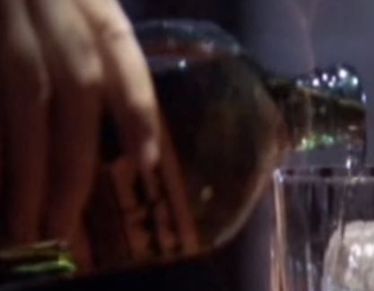
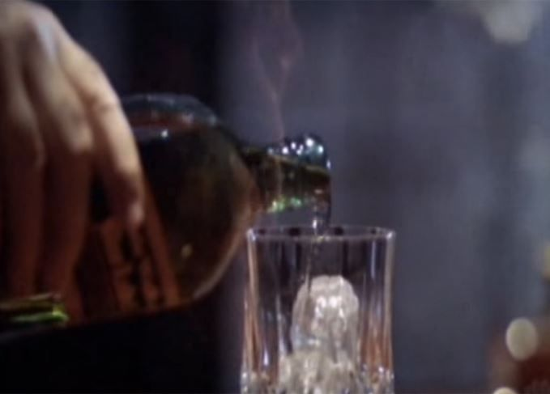

# Evaluation queries and expected labels

Human-readable view of the evaluation queries in `data/eval/`. **Text**, **image** (crop/scene pairs), **whole image + text**, and **cropped image + text** benchmarks are each a single HTML table (queries, thumbnails where relevant, expected catalogue names). Positives are **controlled seeds** (rules or manual scene mapping), not full human relevance judgments. Paths, notes, rules, and JSONL product IDs sit in collapsed **appendix** blocks.

Scene and crop pictures are copied into [`docs/eval_query_images/`](eval_query_images/) so they display on GitHub.

## Table of contents

- [Text queries](#text-queries)
- [Image queries](#image-queries)
- [Image + text queries](#image-text-queries)
- [Cropped image + text queries](#cropped-image-text-queries)
- [Gemini ranking notebooks](#gemini-ranking-notebooks)
- [Live demo notebooks](#live-demo-notebooks)

## Source files

| File | Query type | Count |
|------|------------|-------|
| `data/eval/text_queries.jsonl` | text | 20 |
| `data/eval/image_queries.jsonl` | image (crop + scene pairs) | 22 |
| `data/eval/image_text_queries.jsonl` | whole image + text | 11 |
| `data/eval/cropped_image_text_queries.jsonl` | cropped image + text | 11 |

<a id="gemini-ranking-notebooks"></a>
## Inspect Gemini retrieval output (notebooks)

After you have run Gemini evaluation, open a notebook under `notebooks/` to browse **real rankings** per setting. Each loads `data/eval/gemini_retrieval_report.json`, the matching query/product embeddings, and catalogue rows **offline** (no API calls).

| # | Retrieval setting | Notebook |
|---|------------------|----------|
| 1 | Text query → product text | [`gemini_review_01_text_to_product_text.ipynb`](../notebooks/gemini_review_01_text_to_product_text.ipynb) |
| 2 | Text query → product multimodal | [`gemini_review_02_text_to_product_multimodal.ipynb`](../notebooks/gemini_review_02_text_to_product_multimodal.ipynb) |
| 3 | Cropped image → product image | [`gemini_review_03_cropped_image_to_product_image.ipynb`](../notebooks/gemini_review_03_cropped_image_to_product_image.ipynb) |
| 4 | Whole scene image → product image | [`gemini_review_04_whole_image_to_product_image.ipynb`](../notebooks/gemini_review_04_whole_image_to_product_image.ipynb) |
| 5 | Cropped image → product multimodal | [`gemini_review_05_cropped_image_to_product_multimodal.ipynb`](../notebooks/gemini_review_05_cropped_image_to_product_multimodal.ipynb) |
| 6 | Whole scene image → product multimodal | [`gemini_review_06_whole_image_to_product_multimodal.ipynb`](../notebooks/gemini_review_06_whole_image_to_product_multimodal.ipynb) |
| 7 | Whole image + text → product multimodal | [`gemini_review_07_image_text_to_product_multimodal.ipynb`](../notebooks/gemini_review_07_image_text_to_product_multimodal.ipynb) |
| 8 | Cropped image + text → product image | [`gemini_review_08_cropped_image_text_to_product_image.ipynb`](../notebooks/gemini_review_08_cropped_image_text_to_product_image.ipynb) |
| 9 | Cropped image + text → product multimodal | [`gemini_review_09_cropped_image_text_to_product_multimodal.ipynb`](../notebooks/gemini_review_09_cropped_image_text_to_product_multimodal.ipynb) |

<a id="live-demo-notebooks"></a>
## Live demo notebooks

These notebooks make live API calls from API keys typed into notebook cells:

| Demo | Purpose | Notebook |
|------|---------|----------|
| 1 | Direct embedding demo for live text/image queries | [`demo_01_direct_embedding_results.ipynb`](../notebooks/demo_01_direct_embedding_results.ipynb) |
| 2 | Google File Search RAG demo for live text/image queries | [`demo_02_rag_results.ipynb`](../notebooks/demo_02_rag_results.ipynb) |

---

<a id="text-queries"></a>
## Text queries

One row per benchmark query. **Expected positives** lists catalogue names that count as a hit (Hit@k / MRR). Notes and technical IDs are in the appendix below.

<table>
<thead><tr>
<th align='left'>ID</th>
<th align='left'>Style</th>
<th align='left'>Query</th>
<th align='left'>Expected positives</th>
</tr></thead>
<tbody>
<tr>
<td valign='top'><code>tq001</code></td>
<td valign='top'><code>metadata_brand</code></td>
<td valign='top'>I want an Ardbeg whisky.</td>
<td valign='top'><ul><li><strong>ARDBEG 10-YEAR-OLD</strong></li><li><strong>ARDBEG AIRIGH NAM BEIST</strong></li><li><strong>ARDBEG BLASDA</strong></li><li><strong>ARDBEG UIGEADAIL</strong></li></ul></td>
</tr>
<tr>
<td valign='top'><code>tq002</code></td>
<td valign='top'><code>metadata_brand</code></td>
<td valign='top'>I want a Macallan whisky.</td>
<td valign='top'><ul><li><strong>THE MACALLAN 10-YEAR-OLD</strong></li><li><strong>THE MACALLAN FINE OAK 10-YEAR-OLD</strong></li><li><strong>THE MACALLAN 30-YEAR-OLD</strong></li><li><strong>THE MACALLAN 25-YEAR-OLD</strong></li></ul></td>
</tr>
<tr>
<td valign='top'><code>tq003</code></td>
<td valign='top'><code>metadata_brand</code></td>
<td valign='top'>I want a Glenmorangie whisky.</td>
<td valign='top'><ul><li><strong>GLENMORANGIE ORIGINAL</strong></li><li><strong>GLENMORANGIE 18-YEAR-OLD</strong></li><li><strong>GLENMORANGIE 25-YEAR-OLD</strong></li><li><strong>GLENMORANGIE NECTAR D’OR</strong></li></ul></td>
</tr>
<tr>
<td valign='top'><code>tq004</code></td>
<td valign='top'><code>metadata_brand</code></td>
<td valign='top'>I want a Johnnie Walker whisky.</td>
<td valign='top'><ul><li><strong>JOHNNIE WALKER BLACK LABEL</strong></li><li><strong>JOHNNIE WALKER GREEN LABEL</strong></li><li><strong>JOHNNIE WALKER GOLD LABEL</strong></li><li><strong>JOHNNIE WALKER BLUE LABEL</strong></li></ul></td>
</tr>
<tr>
<td valign='top'><code>tq005</code></td>
<td valign='top'><code>metadata_brand</code></td>
<td valign='top'>I want a Woodford Reserve bourbon.</td>
<td valign='top'><ul><li><strong>WOODFORD RESERVE DISTILLER’S SELECT</strong></li><li><strong>MASTER’S COLLECTION FOUR GRAIN</strong></li><li><strong>MASTER’S COLLECTION SONOMA-CUTRER FINISH</strong></li><li><strong>MASTER’S COLLECTION 1838 SWEET MASH</strong></li></ul></td>
</tr>
<tr>
<td valign='top'><code>tq006</code></td>
<td valign='top'><code>semantic_brand_description</code></td>
<td valign='top'>I want whisky from the southern coast of Islay, famous for pungent heavily peated malts.</td>
<td valign='top'><ul><li><strong>ARDBEG 10-YEAR-OLD</strong></li><li><strong>ARDBEG AIRIGH NAM BEIST</strong></li><li><strong>ARDBEG BLASDA</strong></li><li><strong>ARDBEG UIGEADAIL</strong></li></ul></td>
</tr>
<tr>
<td valign='top'><code>tq007</code></td>
<td valign='top'><code>semantic_brand_description</code></td>
<td valign='top'>I want bourbon from a small Kentucky distillery that uses triple distillation and copper pot stills.</td>
<td valign='top'><ul><li><strong>WOODFORD RESERVE DISTILLER’S SELECT</strong></li><li><strong>MASTER’S COLLECTION FOUR GRAIN</strong></li><li><strong>MASTER’S COLLECTION SONOMA-CUTRER FINISH</strong></li><li><strong>MASTER’S COLLECTION 1838 SWEET MASH</strong></li></ul></td>
</tr>
<tr>
<td valign='top'><code>tq008</code></td>
<td valign='top'><code>semantic_brand_description</code></td>
<td valign='top'>I want Irish whiskey from a Victorian distillery that sells both blends and single malts under the same name.</td>
<td valign='top'><ul><li><strong>BUSHMILLS ORIGINAL</strong></li><li><strong>BUSHMILLS BLACK BUSH</strong></li><li><strong>BUSHMILLS MALT 10-YEAR-OLD</strong></li><li><strong>BUSHMILLS MALT 16-YEAR-OLD</strong></li></ul></td>
</tr>
<tr>
<td valign='top'><code>tq009</code></td>
<td valign='top'><code>semantic_brand_description</code></td>
<td valign='top'>I want Japanese whisky from the country's first malt distillery, especially sweet fruity single malts and older sherry cask releases.</td>
<td valign='top'><ul><li><strong>THE YAMAZAKI 12-YEAR-OLD</strong></li><li><strong>THE YAMAZAKI 18-YEAR-OLD</strong></li><li><strong>SUNTORY VINTAGE 1984</strong></li><li><strong>THE CASK OF YAMAZAKI 1990 SHERRY BUTT</strong></li></ul></td>
</tr>
<tr>
<td valign='top'><code>tq010</code></td>
<td valign='top'><code>semantic_brand_description</code></td>
<td valign='top'>I want Islay whisky from the shore of Loch Indaal, a distillery revived by Murray McDavid that bottles on the island.</td>
<td valign='top'><ul><li><strong>BRUICHLADDICH 18-YEAR-OLD</strong></li><li><strong>BRUICHLADDICH 21-YEAR-OLD</strong></li><li><strong>BRUICHLADDICH WAVES</strong></li><li><strong>BRUICHLADDICH PEAT</strong></li></ul></td>
</tr>
<tr>
<td valign='top'><code>tq011</code></td>
<td valign='top'><code>metadata_abv</code></td>
<td valign='top'>I want an Ardbeg whisky around 40 percent ABV.</td>
<td valign='top'><ul><li><strong>ARDBEG BLASDA</strong></li></ul></td>
</tr>
<tr>
<td valign='top'><code>tq012</code></td>
<td valign='top'><code>metadata_abv</code></td>
<td valign='top'>I want Bruichladdich single malts bottled at 46 percent ABV.</td>
<td valign='top'><ul><li><strong>BRUICHLADDICH 18-YEAR-OLD</strong></li><li><strong>BRUICHLADDICH 21-YEAR-OLD</strong></li><li><strong>BRUICHLADDICH WAVES</strong></li><li><strong>BRUICHLADDICH PEAT</strong></li></ul></td>
</tr>
<tr>
<td valign='top'><code>tq013</code></td>
<td valign='top'><code>metadata_abv</code></td>
<td valign='top'>I want a very high proof bourbon over 60 percent ABV.</td>
<td valign='top'><ul><li><strong>BOOKER’S KENTUCKY STRAIGHT</strong></li><li><strong>GEORGE T. STAGG 2008 EDITION</strong></li></ul></td>
</tr>
<tr>
<td valign='top'><code>tq014</code></td>
<td valign='top'><code>metadata_abv</code></td>
<td valign='top'>I want Laphroaig cask strength whisky around 57 percent ABV.</td>
<td valign='top'><ul><li><strong>LAPHROAIG 10-YEAR-OLD CASK STRENGTH</strong></li></ul></td>
</tr>
<tr>
<td valign='top'><code>tq015</code></td>
<td valign='top'><code>semantic_flavour</code></td>
<td valign='top'>I want smoky peaty whisky with seaweed iodine tar and a long coastal finish.</td>
<td valign='top'><ul><li><strong>ARDBEG 10-YEAR-OLD</strong></li><li><strong>BRUICHLADDICH PEAT</strong></li><li><strong>CAOL ILA 12-YEAR-OLD</strong></li><li><strong>LAGAVULIN 16-YEAR-OLD</strong></li><li><strong>LAPHROAIG 10-YEAR-OLD CASK STRENGTH</strong></li><li><strong>LAPHROAIG10-YEAR-OLD</strong></li></ul></td>
</tr>
<tr>
<td valign='top'><code>tq016</code></td>
<td valign='top'><code>semantic_flavour</code></td>
<td valign='top'>I want sherry matured whisky with raisins fruitcake oloroso spice and rich sweetness.</td>
<td valign='top'><ul><li><strong>ABERLOUR 12-YEAR-OLD SHERRY MATURED</strong></li><li><strong>ABERLOUR A’BUNADH</strong></li><li><strong>GLENFARCLAS 12-YEAR-OLD</strong></li><li><strong>GLENFARCLAS 15-YEAR-OLD</strong></li><li><strong>THE GLENLIVET XXV</strong></li><li><strong>MORTLACH FLORA &amp; FAUNA 16-YEAR-OLD</strong></li></ul></td>
</tr>
<tr>
<td valign='top'><code>tq017</code></td>
<td valign='top'><code>semantic_flavour</code></td>
<td valign='top'>I want bourbon with vanilla caramel honey oak and a rounded sweet palate.</td>
<td valign='top'><ul><li><strong>BAKER’S 7-YEAR-OLD</strong></li><li><strong>BLANTON’S SINGLE BARREL</strong></li><li><strong>BUFFALO TRACE KENTUCKY STRAIGHT BOURBON</strong></li><li><strong>BULLEIT BOURBON</strong></li><li><strong>ELIJAH CRAIG 12-YEAR-OLD</strong></li><li><strong>OLD FORESTER BIRTHDAY BOURBON (2007)</strong></li></ul></td>
</tr>
<tr>
<td valign='top'><code>tq018</code></td>
<td valign='top'><code>semantic_flavour</code></td>
<td valign='top'>I want whisky with honey apples orchard fruit vanilla and a smooth easy palate.</td>
<td valign='top'><ul><li><strong>ABERFELDY 12-YEAR-OLD</strong></li><li><strong>BALLANTINE’S FINEST</strong></li><li><strong>BALLANTINE’S 12-YEAR-OLD</strong></li><li><strong>CHIVAS REGAL 12-YEAR-OLD</strong></li><li><strong>WINDSOR 12-YEAR-OLD</strong></li></ul></td>
</tr>
<tr>
<td valign='top'><code>tq019</code></td>
<td valign='top'><code>semantic_flavour</code></td>
<td valign='top'>I want rye whiskey with pepper mint spice oak and a dry finish.</td>
<td valign='top'><ul><li><strong>HUDSON MANHATTAN RYE</strong></li><li><strong>OLD POTRERO RYE</strong></li><li><strong>PIKESVILLE SUPREME</strong></li><li><strong>RUSSELL’S RESERVE RYE</strong></li><li><strong>SAZERAC RYE 18-YEAR-OLD</strong></li><li><strong>THOMAS H. HANDY SAZERAC 2008 EDITION</strong></li></ul></td>
</tr>
<tr>
<td valign='top'><code>tq020</code></td>
<td valign='top'><code>semantic_flavour</code></td>
<td valign='top'>I want whisky with chocolate cocoa raisins figs and rich dessert notes.</td>
<td valign='top'><ul><li><strong>BRAUNSTEIN</strong></li><li><strong>DIMPLE 15-YEAR-OLD</strong></li><li><strong>GRÜNER HUND</strong></li><li><strong>HANKEY BANNISTER 40-YEAR-OLD</strong></li><li><strong>THE LAST DROP</strong></li><li><strong>WOODFORD RESERVE DISTILLER’S SELECT</strong></li></ul></td>
</tr>
</tbody></table>

<details>
<summary><strong>Appendix (text queries):</strong> notes, label rules, product IDs</summary>

<table>
<thead><tr>
<th align='left'>ID</th>
<th align='left'>Notes</th>
<th align='left'>How labelled</th>
<th align='left'>Product IDs</th>
</tr></thead><tbody>
<tr>
<td valign='top'><code>tq001</code></td>
<td valign='top'>Direct brand lookup with all parsed Ardbeg products as relevant.</td>
<td valign='top'>rule_based_keyword_search_over_product_metadata_and_description — brand_or_distillery equals ARDBEG</td>
<td valign='top'><code>p0021-ardbeg-10-year-old</code>, <code>p0021-ardbeg-airigh-nam-beist</code>, <code>p0022-ardbeg-blasda</code>, <code>p0022-ardbeg-uigeadail</code></td>
</tr>
<tr>
<td valign='top'><code>tq002</code></td>
<td valign='top'>Direct brand lookup with all parsed Macallan products as relevant.</td>
<td valign='top'>rule_based_keyword_search_over_product_metadata_and_description — brand_or_distillery equals MACALLAN</td>
<td valign='top'><code>p0243-the-macallan-10-year-old</code>, <code>p0243-the-macallan-fine-oak-10-year-old</code>, <code>p0244-the-macallan-30-year-old</code>, <code>p0244-the-macallan-25-year-old</code></td>
</tr>
<tr>
<td valign='top'><code>tq003</code></td>
<td valign='top'>Direct brand lookup with all parsed Glenmorangie products as relevant.</td>
<td valign='top'>rule_based_keyword_search_over_product_metadata_and_description — brand_or_distillery equals GLENMORANGIE</td>
<td valign='top'><code>p0158-glenmorangie-original</code>, <code>p0158-glenmorangie-18-year-old</code>, <code>p0159-glenmorangie-25-year-old</code>, <code>p0159-glenmorangie-nectar-d-or</code></td>
</tr>
<tr>
<td valign='top'><code>tq004</code></td>
<td valign='top'>Direct brand lookup with all parsed Johnnie Walker products as relevant.</td>
<td valign='top'>rule_based_keyword_search_over_product_metadata_and_description — brand_or_distillery equals JOHNNIE WALKER</td>
<td valign='top'><code>p0208-johnnie-walker-black-label</code>, <code>p0208-johnnie-walker-green-label</code>, <code>p0209-johnnie-walker-gold-label</code>, <code>p0209-johnnie-walker-blue-label</code></td>
</tr>
<tr>
<td valign='top'><code>tq005</code></td>
<td valign='top'>Direct brand lookup with all parsed Woodford Reserve products as relevant.</td>
<td valign='top'>rule_based_keyword_search_over_product_metadata_and_description — brand_or_distillery equals WOODFORD RESERVE</td>
<td valign='top'><code>p0378-woodford-reserve-distiller-s-select</code>, <code>p0378-master-s-collection-four-grain</code>, <code>p0379-master-s-collection-sonoma-cutrer-finish</code>, <code>p0379-master-s-collection-1838-sweet-mash</code></td>
</tr>
<tr>
<td valign='top'><code>tq006</code></td>
<td valign='top'>Brand-description semantic query for Ardbeg without naming the brand.</td>
<td valign='top'>rule_based_keyword_search_over_product_metadata_and_description — brand_description mentions Islay, southern coast, pungent peat-smoked whisky, and Ardbeg context</td>
<td valign='top'><code>p0021-ardbeg-10-year-old</code>, <code>p0021-ardbeg-airigh-nam-beist</code>, <code>p0022-ardbeg-blasda</code>, <code>p0022-ardbeg-uigeadail</code></td>
</tr>
<tr>
<td valign='top'><code>tq007</code></td>
<td valign='top'>Brand-description semantic query for Woodford Reserve without naming the brand.</td>
<td valign='top'>rule_based_keyword_search_over_product_metadata_and_description — brand_description mentions smallest Kentucky distillery, triple distillation, and three copper pot stills</td>
<td valign='top'><code>p0378-woodford-reserve-distiller-s-select</code>, <code>p0378-master-s-collection-four-grain</code>, <code>p0379-master-s-collection-sonoma-cutrer-finish</code>, <code>p0379-master-s-collection-1838-sweet-mash</code></td>
</tr>
<tr>
<td valign='top'><code>tq008</code></td>
<td valign='top'>Brand-description semantic query for Bushmills without requiring exact product names.</td>
<td valign='top'>rule_based_keyword_search_over_product_metadata_and_description — brand_description mentions Old Bushmills, Victorian building, blends, and single malts under the same brand</td>
<td valign='top'><code>p0071-bushmills-original</code>, <code>p0071-bushmills-black-bush</code>, <code>p0072-bushmills-malt-10-year-old</code>, <code>p0072-bushmills-malt-16-year-old</code></td>
</tr>
<tr>
<td valign='top'><code>tq009</code></td>
<td valign='top'>Brand-description semantic query for Suntory Yamazaki.</td>
<td valign='top'>rule_based_keyword_search_over_product_metadata_and_description — brand_description mentions first malt distillery in Japan, sweet fruity official bottlings, and older ex-sherry casks</td>
<td valign='top'><code>p0335-the-yamazaki-12-year-old</code>, <code>p0335-the-yamazaki-18-year-old</code>, <code>p0336-suntory-vintage-1984</code>, <code>p0336-the-cask-of-yamazaki-1990-sherry-butt</code></td>
</tr>
<tr>
<td valign='top'><code>tq010</code></td>
<td valign='top'>Brand-description semantic query for Bruichladdich without naming the brand.</td>
<td valign='top'>rule_based_keyword_search_over_product_metadata_and_description — brand_description mentions Loch Indaal, Islay, Murray McDavid, and bottling on the island</td>
<td valign='top'><code>p0065-bruichladdich-18-year-old</code>, <code>p0065-bruichladdich-21-year-old</code>, <code>p0066-bruichladdich-waves</code>, <code>p0066-bruichladdich-peat</code></td>
</tr>
<tr>
<td valign='top'><code>tq011</code></td>
<td valign='top'>Narrow ABV sanity check with brand context to avoid a very large answer set.</td>
<td valign='top'>rule_based_keyword_search_over_product_metadata_and_description — brand_or_distillery equals ARDBEG and ABV is between 40 and 43</td>
<td valign='top'><code>p0022-ardbeg-blasda</code></td>
</tr>
<tr>
<td valign='top'><code>tq012</code></td>
<td valign='top'>ABV query where several same-brand products share the same parsed strength.</td>
<td valign='top'>rule_based_keyword_search_over_product_metadata_and_description — brand_or_distillery equals BRUICHLADDICH, style is Single Malt, and ABV equals 46</td>
<td valign='top'><code>p0065-bruichladdich-18-year-old</code>, <code>p0065-bruichladdich-21-year-old</code>, <code>p0066-bruichladdich-waves</code>, <code>p0066-bruichladdich-peat</code></td>
</tr>
<tr>
<td valign='top'><code>tq013</code></td>
<td valign='top'>High-proof bourbon metadata query using parsed ABV.</td>
<td valign='top'>rule_based_keyword_search_over_product_metadata_and_description — style contains Bourbon and ABV is greater than or equal to 60</td>
<td valign='top'><code>p0059-booker-s-kentucky-straight</code>, <code>p0129-george-t-stagg-2008-edition</code></td>
</tr>
<tr>
<td valign='top'><code>tq014</code></td>
<td valign='top'>ABV query tied to a known cask-strength product.</td>
<td valign='top'>rule_based_keyword_search_over_product_metadata_and_description — brand_or_distillery equals LAPHROAIG, name contains cask strength, and ABV is at least 55</td>
<td valign='top'><code>p0228-laphroaig-10-year-old-cask-strength</code></td>
</tr>
<tr>
<td valign='top'><code>tq015</code></td>
<td valign='top'>Core flavour query for classic peated/coastal whisky.</td>
<td valign='top'>rule_based_keyword_search_over_product_metadata_and_description — description contains multiple smoky, peaty, tar, seaweed, iodine, salt, or coastal terms</td>
<td valign='top'><code>p0021-ardbeg-10-year-old</code>, <code>p0066-bruichladdich-peat</code>, <code>p0077-caol-ila-12-year-old</code>, <code>p0224-lagavulin-16-year-old</code>, <code>p0228-laphroaig-10-year-old-cask-strength</code>, <code>p0228-laphroaig10-year-old</code></td>
</tr>
<tr>
<td valign='top'><code>tq016</code></td>
<td valign='top'>Semantic flavour query centered on sherry and dried-fruit descriptors.</td>
<td valign='top'>rule_based_keyword_search_over_product_metadata_and_description — name or description contains sherry, oloroso, raisin, fruitcake, spicy, or rich sherry influence</td>
<td valign='top'><code>p0013-aberlour-12-year-old-sherry-matured</code>, <code>p0013-aberlour-a-bunadh</code>, <code>p0147-glenfarclas-12-year-old</code>, <code>p0147-glenfarclas-15-year-old</code>, <code>p0156-the-glenlivet-xxv</code>, <code>p0264-mortlach-flora-fauna-16-year-old</code></td>
</tr>
<tr>
<td valign='top'><code>tq017</code></td>
<td valign='top'>Broad bourbon flavour query where text embeddings should connect related sweetness and oak terms.</td>
<td valign='top'>rule_based_keyword_search_over_product_metadata_and_description — style contains Bourbon and description contains multiple vanilla, caramel, honey, oak, toffee, or sweet terms</td>
<td valign='top'><code>p0032-baker-s-7-year-old</code>, <code>p0057-blanton-s-single-barrel</code>, <code>p0068-buffalo-trace-kentucky-straight-bourbon</code>, <code>p0069-bulleit-bourbon</code>, <code>p0117-elijah-craig-12-year-old</code>, <code>p0277-old-forester-birthday-bourbon-2007</code></td>
</tr>
<tr>
<td valign='top'><code>tq018</code></td>
<td valign='top'>Approachable flavour query crossing single malts and blends.</td>
<td valign='top'>rule_based_keyword_search_over_product_metadata_and_description — description contains honey plus apple, orchard fruit, vanilla, smooth, rounded, or easy-drinking terms</td>
<td valign='top'><code>p0012-aberfeldy-12-year-old</code>, <code>p0035-ballantine-s-finest</code>, <code>p0035-ballantine-s-12-year-old</code>, <code>p0083-chivas-regal-12-year-old</code>, <code>p0375-windsor-12-year-old</code></td>
</tr>
<tr>
<td valign='top'><code>tq019</code></td>
<td valign='top'>Style plus flavour query for rye-forward products.</td>
<td valign='top'>rule_based_keyword_search_over_product_metadata_and_description — style or description contains rye and description contains pepper, mint, spice, oak, or dry finish terms</td>
<td valign='top'><code>p0187-hudson-manhattan-rye</code>, <code>p0280-old-potrero-rye</code>, <code>p0290-pikesville-supreme</code>, <code>p0310-russell-s-reserve-rye</code>, <code>p0312-sazerac-rye-18-year-old</code>, <code>p0347-thomas-h-handy-sazerac-2008-edition</code></td>
</tr>
<tr>
<td valign='top'><code>tq020</code></td>
<td valign='top'>Cross-style semantic flavour query focused on dessert and dried-fruit notes.</td>
<td valign='top'>rule_based_keyword_search_over_product_metadata_and_description — description contains chocolate, cocoa, raisins, figs, dried fruit, or dessert-like rich notes</td>
<td valign='top'><code>p0064-braunstein</code>, <code>p0108-dimple-15-year-old</code>, <code>p0172-gr-ner-hund</code>, <code>p0176-hankey-bannister-40-year-old</code>, <code>p0231-the-last-drop</code>, <code>p0378-woodford-reserve-distiller-s-select</code></td>
</tr>
</tbody></table>

</details>

---

<a id="image-queries"></a>
## Image queries (cropped bottle and whole scene)

One row per movie/TV still. **Crop** vs **scene** are two image-only evaluation queries on the same frame; expected positives match. File paths and JSONL product IDs are in the appendix.

<table>
<thead><tr>
<th align='left'>Still</th>
<th align='left'>Screen</th>
<th align='left'>Whisky (annotation)</th>
<th align='left'>Query IDs</th>
<th align='left'>Crop</th>
<th align='left'>Scene</th>
<th align='left'>Expected positives</th>
</tr></thead><tbody>
<tr>
<td valign='top'><code>msq001</code></td>
<td valign='top'>Skyfall</td>
<td valign='top'>Macallan 1962 Fine &amp; Rare</td>
<td valign='top'><code>iq001_crop</code>, <code>iq001_scene</code></td>
<td valign='top'></td>
<td valign='top'></td>
<td valign='top'><ul><li><strong>THE MACALLAN 10-YEAR-OLD</strong></li><li><strong>THE MACALLAN FINE OAK 10-YEAR-OLD</strong></li><li><strong>THE MACALLAN 25-YEAR-OLD</strong></li><li><strong>THE MACALLAN 30-YEAR-OLD</strong></li></ul></td>
</tr>
<tr>
<td valign='top'><code>msq002</code></td>
<td valign='top'>Lost in Translation</td>
<td valign='top'>Suntory Hibiki 17</td>
<td valign='top'><code>iq002_crop</code>, <code>iq002_scene</code></td>
<td valign='top'></td>
<td valign='top'></td>
<td valign='top'><ul><li><strong>SUNTORY HIBIKI 17-YEAR-OLD</strong></li><li><strong>SUNTORY HIBIKI 30-YEAR-OLD</strong></li></ul></td>
</tr>
<tr>
<td valign='top'><code>msq003</code></td>
<td valign='top'>Blade Runner</td>
<td valign='top'>Johnnie Walker Black Label</td>
<td valign='top'><code>iq003_crop</code>, <code>iq003_scene</code></td>
<td valign='top'></td>
<td valign='top'></td>
<td valign='top'><ul><li><strong>JOHNNIE WALKER BLACK LABEL</strong></li><li><strong>JOHNNIE WALKER GREEN LABEL</strong></li><li><strong>JOHNNIE WALKER GOLD LABEL</strong></li><li><strong>JOHNNIE WALKER BLUE LABEL</strong></li></ul></td>
</tr>
<tr>
<td valign='top'><code>msq004</code></td>
<td valign='top'>John Wick</td>
<td valign='top'>Blanton's Bourbon</td>
<td valign='top'><code>iq004_crop</code>, <code>iq004_scene</code></td>
<td valign='top'></td>
<td valign='top'></td>
<td valign='top'><ul><li><strong>BLANTON’S SINGLE BARREL</strong></li></ul></td>
</tr>
<tr>
<td valign='top'><code>msq005</code></td>
<td valign='top'>The Shining</td>
<td valign='top'>Jack Daniel's Old No. 7</td>
<td valign='top'><code>iq005_crop</code>, <code>iq005_scene</code></td>
<td valign='top'></td>
<td valign='top'></td>
<td valign='top'><ul><li><strong>JACK DANIEL’S OLD NO. 7</strong></li><li><strong>JACK DANIEL’S SINGLE BARREL</strong></li></ul></td>
</tr>
<tr>
<td valign='top'><code>msq006</code></td>
<td valign='top'>The Last of Us</td>
<td valign='top'>Laphroaig</td>
<td valign='top'><code>iq006_crop</code>, <code>iq006_scene</code></td>
<td valign='top'></td>
<td valign='top'></td>
<td valign='top'><ul><li><strong>LAPHROAIG10-YEAR-OLD</strong></li><li><strong>LAPHROAIG 10-YEAR-OLD CASK STRENGTH</strong></li><li><strong>LAPHROAIG QUARTER CASK</strong></li><li><strong>LAPHROAIG 25-YEAR-OLD</strong></li></ul></td>
</tr>
<tr>
<td valign='top'><code>msq007</code></td>
<td valign='top'>28 Days Later / Parks and Recreation</td>
<td valign='top'>Lagavulin</td>
<td valign='top'><code>iq007_crop</code>, <code>iq007_scene</code></td>
<td valign='top'></td>
<td valign='top'></td>
<td valign='top'><ul><li><strong>LAGAVULIN 16-YEAR-OLD</strong></li><li><strong>LAGAVULIN 12-YEAR-OLD</strong></li><li><strong>LAGAVULIN DISTILLERS EDITION</strong></li><li><strong>LAGAVULIN 21-YEAR-OLD</strong></li></ul></td>
</tr>
<tr>
<td valign='top'><code>msq008</code></td>
<td valign='top'>Constantine</td>
<td valign='top'>Ardbeg 10</td>
<td valign='top'><code>iq008_crop</code>, <code>iq008_scene</code></td>
<td valign='top'></td>
<td valign='top'></td>
<td valign='top'><ul><li><strong>ARDBEG 10-YEAR-OLD</strong></li><li><strong>ARDBEG AIRIGH NAM BEIST</strong></li><li><strong>ARDBEG BLASDA</strong></li><li><strong>ARDBEG UIGEADAIL</strong></li></ul></td>
</tr>
<tr>
<td valign='top'><code>msq009</code></td>
<td valign='top'>Suits</td>
<td valign='top'>Macallan 18</td>
<td valign='top'><code>iq009_crop</code>, <code>iq009_scene</code></td>
<td valign='top'></td>
<td valign='top'></td>
<td valign='top'><ul><li><strong>THE MACALLAN 10-YEAR-OLD</strong></li><li><strong>THE MACALLAN FINE OAK 10-YEAR-OLD</strong></li><li><strong>THE MACALLAN 25-YEAR-OLD</strong></li><li><strong>THE MACALLAN 30-YEAR-OLD</strong></li></ul></td>
</tr>
<tr>
<td valign='top'><code>msq010</code></td>
<td valign='top'>Mad Men</td>
<td valign='top'>Canadian Club</td>
<td valign='top'><code>iq010_crop</code>, <code>iq010_scene</code></td>
<td valign='top'></td>
<td valign='top'></td>
<td valign='top'><ul><li><strong>CANADIAN CLUB RESERVE</strong></li><li><strong>CANADIAN CLUB 6-YEAR-OLD 100 PROOF</strong></li><li><strong>CANADIAN CLUB PREMIUM</strong></li><li><strong>CANADIAN CLUB CLASSIC</strong></li></ul></td>
</tr>
<tr>
<td valign='top'><code>msq011</code></td>
<td valign='top'>The West Wing</td>
<td valign='top'>Johnnie Walker Blue Label</td>
<td valign='top'><code>iq011_crop</code>, <code>iq011_scene</code></td>
<td valign='top'></td>
<td valign='top'></td>
<td valign='top'><ul><li><strong>JOHNNIE WALKER BLUE LABEL</strong></li><li><strong>JOHNNIE WALKER BLACK LABEL</strong></li><li><strong>JOHNNIE WALKER GREEN LABEL</strong></li><li><strong>JOHNNIE WALKER GOLD LABEL</strong></li></ul></td>
</tr>
</tbody></table>

<details>
<summary><strong>Appendix (image queries):</strong> paths and product IDs</summary>

<table>
<thead><tr>
<th align='left'>Still</th>
<th align='left'>Crop path</th>
<th align='left'>Scene path</th>
<th align='left'>Product IDs</th>
</tr></thead><tbody>
<tr>
<td valign='top'><code>msq001</code></td>
<td valign='top'><code>data/eval/movie_scene_bottle_crops/msq001-skyfall-macallan.crop.jpg</code></td>
<td valign='top'><code>data/eval/movie_scene_query_images/msq001-skyfall-macallan.jpg</code></td>
<td valign='top'><code>p0243-the-macallan-10-year-old</code>, <code>p0243-the-macallan-fine-oak-10-year-old</code>, <code>p0244-the-macallan-25-year-old</code>, <code>p0244-the-macallan-30-year-old</code></td>
</tr>
<tr>
<td valign='top'><code>msq002</code></td>
<td valign='top'><code>data/eval/movie_scene_bottle_crops/msq002-lost-in-translation-hibiki.crop.jpg</code></td>
<td valign='top'><code>data/eval/movie_scene_query_images/msq002-lost-in-translation-hibiki.jpg</code></td>
<td valign='top'><code>p0334-suntory-hibiki-17-year-old</code>, <code>p0334-suntory-hibiki-30-year-old</code></td>
</tr>
<tr>
<td valign='top'><code>msq003</code></td>
<td valign='top'><code>data/eval/movie_scene_bottle_crops/msq003-blade-runner-johnnie-walker.crop.jpg</code></td>
<td valign='top'><code>data/eval/movie_scene_query_images/msq003-blade-runner-johnnie-walker.jpg</code></td>
<td valign='top'><code>p0208-johnnie-walker-black-label</code>, <code>p0208-johnnie-walker-green-label</code>, <code>p0209-johnnie-walker-gold-label</code>, <code>p0209-johnnie-walker-blue-label</code></td>
</tr>
<tr>
<td valign='top'><code>msq004</code></td>
<td valign='top'><code>data/eval/movie_scene_bottle_crops/msq004-john-wick-blantons.crop.jpg</code></td>
<td valign='top'><code>data/eval/movie_scene_query_images/msq004-john-wick-blantons.jpg</code></td>
<td valign='top'><code>p0057-blanton-s-single-barrel</code></td>
</tr>
<tr>
<td valign='top'><code>msq005</code></td>
<td valign='top'><code>data/eval/movie_scene_bottle_crops/msq005-the-shining-jack-daniels.crop.jpg</code></td>
<td valign='top'><code>data/eval/movie_scene_query_images/msq005-the-shining-jack-daniels.jpg</code></td>
<td valign='top'><code>p0199-jack-daniel-s-old-no-7</code>, <code>p0199-jack-daniel-s-single-barrel</code></td>
</tr>
<tr>
<td valign='top'><code>msq006</code></td>
<td valign='top'><code>data/eval/movie_scene_bottle_crops/msq006-last-of-us-laphroaig.crop.jpg</code></td>
<td valign='top'><code>data/eval/movie_scene_query_images/msq006-last-of-us-laphroaig.jpg</code></td>
<td valign='top'><code>p0228-laphroaig10-year-old</code>, <code>p0228-laphroaig-10-year-old-cask-strength</code>, <code>p0229-laphroaig-quarter-cask</code>, <code>p0229-laphroaig-25-year-old</code></td>
</tr>
<tr>
<td valign='top'><code>msq007</code></td>
<td valign='top'><code>data/eval/movie_scene_bottle_crops/msq007-lagavulin-screen-reference.crop.jpg</code></td>
<td valign='top'><code>data/eval/movie_scene_query_images/msq007-lagavulin-screen-reference.jpg</code></td>
<td valign='top'><code>p0224-lagavulin-16-year-old</code>, <code>p0224-lagavulin-12-year-old</code>, <code>p0225-lagavulin-distillers-edition</code>, <code>p0225-lagavulin-21-year-old</code></td>
</tr>
<tr>
<td valign='top'><code>msq008</code></td>
<td valign='top'><code>data/eval/movie_scene_bottle_crops/msq008-constantine-ardbeg.crop.jpg</code></td>
<td valign='top'><code>data/eval/movie_scene_query_images/msq008-constantine-ardbeg.jpg</code></td>
<td valign='top'><code>p0021-ardbeg-10-year-old</code>, <code>p0021-ardbeg-airigh-nam-beist</code>, <code>p0022-ardbeg-blasda</code>, <code>p0022-ardbeg-uigeadail</code></td>
</tr>
<tr>
<td valign='top'><code>msq009</code></td>
<td valign='top'><code>data/eval/movie_scene_bottle_crops/msq009-suits-macallan.crop.jpg</code></td>
<td valign='top'><code>data/eval/movie_scene_query_images/msq009-suits-macallan.jpg</code></td>
<td valign='top'><code>p0243-the-macallan-10-year-old</code>, <code>p0243-the-macallan-fine-oak-10-year-old</code>, <code>p0244-the-macallan-25-year-old</code>, <code>p0244-the-macallan-30-year-old</code></td>
</tr>
<tr>
<td valign='top'><code>msq010</code></td>
<td valign='top'><code>data/eval/movie_scene_bottle_crops/msq010-mad-men-canadian-club.crop.jpg</code></td>
<td valign='top'><code>data/eval/movie_scene_query_images/msq010-mad-men-canadian-club.jpg</code></td>
<td valign='top'><code>p0074-canadian-club-reserve</code>, <code>p0074-canadian-club-6-year-old-100-proof</code>, <code>p0075-canadian-club-premium</code>, <code>p0075-canadian-club-classic</code></td>
</tr>
<tr>
<td valign='top'><code>msq011</code></td>
<td valign='top'><code>data/eval/movie_scene_bottle_crops/msq011-west-wing-johnnie-walker-blue.crop.jpg</code></td>
<td valign='top'><code>data/eval/movie_scene_query_images/msq011-west-wing-johnnie-walker-blue.jpg</code></td>
<td valign='top'><code>p0209-johnnie-walker-blue-label</code>, <code>p0208-johnnie-walker-black-label</code>, <code>p0208-johnnie-walker-green-label</code>, <code>p0209-johnnie-walker-gold-label</code></td>
</tr>
</tbody></table>

</details>

---

<a id="image-text-queries"></a>
## Image + text queries (whole scene + question)

Fixed question for every row: **What is the whisky in this image?** Scenes align with the image-only `*_scene` queries where the source still is shared.

<table>
<thead><tr>
<th align='left'>ID</th>
<th align='left'>Screen</th>
<th align='left'>Whisky (annotation)</th>
<th align='left'>Scene</th>
<th align='left'>Expected positives</th>
</tr></thead><tbody>
<tr>
<td valign='top'><code>itq001</code></td>
<td valign='top'>Skyfall</td>
<td valign='top'>Macallan 1962 Fine &amp; Rare</td>
<td valign='top'></td>
<td valign='top'><ul><li><strong>THE MACALLAN 10-YEAR-OLD</strong></li><li><strong>THE MACALLAN FINE OAK 10-YEAR-OLD</strong></li><li><strong>THE MACALLAN 25-YEAR-OLD</strong></li><li><strong>THE MACALLAN 30-YEAR-OLD</strong></li></ul></td>
</tr>
<tr>
<td valign='top'><code>itq002</code></td>
<td valign='top'>Lost in Translation</td>
<td valign='top'>Suntory Hibiki 17</td>
<td valign='top'></td>
<td valign='top'><ul><li><strong>SUNTORY HIBIKI 17-YEAR-OLD</strong></li><li><strong>SUNTORY HIBIKI 30-YEAR-OLD</strong></li></ul></td>
</tr>
<tr>
<td valign='top'><code>itq003</code></td>
<td valign='top'>Blade Runner</td>
<td valign='top'>Johnnie Walker Black Label</td>
<td valign='top'></td>
<td valign='top'><ul><li><strong>JOHNNIE WALKER BLACK LABEL</strong></li><li><strong>JOHNNIE WALKER GREEN LABEL</strong></li><li><strong>JOHNNIE WALKER GOLD LABEL</strong></li><li><strong>JOHNNIE WALKER BLUE LABEL</strong></li></ul></td>
</tr>
<tr>
<td valign='top'><code>itq004</code></td>
<td valign='top'>John Wick</td>
<td valign='top'>Blanton's Bourbon</td>
<td valign='top'></td>
<td valign='top'><ul><li><strong>BLANTON’S SINGLE BARREL</strong></li></ul></td>
</tr>
<tr>
<td valign='top'><code>itq005</code></td>
<td valign='top'>The Shining</td>
<td valign='top'>Jack Daniel's Old No. 7</td>
<td valign='top'></td>
<td valign='top'><ul><li><strong>JACK DANIEL’S OLD NO. 7</strong></li><li><strong>JACK DANIEL’S SINGLE BARREL</strong></li></ul></td>
</tr>
<tr>
<td valign='top'><code>itq006</code></td>
<td valign='top'>The Last of Us</td>
<td valign='top'>Laphroaig</td>
<td valign='top'></td>
<td valign='top'><ul><li><strong>LAPHROAIG10-YEAR-OLD</strong></li><li><strong>LAPHROAIG 10-YEAR-OLD CASK STRENGTH</strong></li><li><strong>LAPHROAIG QUARTER CASK</strong></li><li><strong>LAPHROAIG 25-YEAR-OLD</strong></li></ul></td>
</tr>
<tr>
<td valign='top'><code>itq007</code></td>
<td valign='top'>28 Days Later / Parks and Recreation</td>
<td valign='top'>Lagavulin</td>
<td valign='top'></td>
<td valign='top'><ul><li><strong>LAGAVULIN 16-YEAR-OLD</strong></li><li><strong>LAGAVULIN 12-YEAR-OLD</strong></li><li><strong>LAGAVULIN DISTILLERS EDITION</strong></li><li><strong>LAGAVULIN 21-YEAR-OLD</strong></li></ul></td>
</tr>
<tr>
<td valign='top'><code>itq008</code></td>
<td valign='top'>Constantine</td>
<td valign='top'>Ardbeg 10</td>
<td valign='top'></td>
<td valign='top'><ul><li><strong>ARDBEG 10-YEAR-OLD</strong></li><li><strong>ARDBEG AIRIGH NAM BEIST</strong></li><li><strong>ARDBEG BLASDA</strong></li><li><strong>ARDBEG UIGEADAIL</strong></li></ul></td>
</tr>
<tr>
<td valign='top'><code>itq009</code></td>
<td valign='top'>Suits</td>
<td valign='top'>Macallan 18</td>
<td valign='top'></td>
<td valign='top'><ul><li><strong>THE MACALLAN 10-YEAR-OLD</strong></li><li><strong>THE MACALLAN FINE OAK 10-YEAR-OLD</strong></li><li><strong>THE MACALLAN 25-YEAR-OLD</strong></li><li><strong>THE MACALLAN 30-YEAR-OLD</strong></li></ul></td>
</tr>
<tr>
<td valign='top'><code>itq010</code></td>
<td valign='top'>Mad Men</td>
<td valign='top'>Canadian Club</td>
<td valign='top'></td>
<td valign='top'><ul><li><strong>CANADIAN CLUB RESERVE</strong></li><li><strong>CANADIAN CLUB 6-YEAR-OLD 100 PROOF</strong></li><li><strong>CANADIAN CLUB PREMIUM</strong></li><li><strong>CANADIAN CLUB CLASSIC</strong></li></ul></td>
</tr>
<tr>
<td valign='top'><code>itq011</code></td>
<td valign='top'>The West Wing</td>
<td valign='top'>Johnnie Walker Blue Label</td>
<td valign='top'></td>
<td valign='top'><ul><li><strong>JOHNNIE WALKER BLUE LABEL</strong></li><li><strong>JOHNNIE WALKER BLACK LABEL</strong></li><li><strong>JOHNNIE WALKER GREEN LABEL</strong></li><li><strong>JOHNNIE WALKER GOLD LABEL</strong></li></ul></td>
</tr>
</tbody></table>

<details>
<summary><strong>Appendix (whole image + text):</strong> paths, notes, product IDs</summary>

<table>
<thead><tr>
<th align='left'>ID</th>
<th align='left'>Source image path</th>
<th align='left'>Notes</th>
<th align='left'>Product IDs</th>
</tr></thead><tbody>
<tr>
<td valign='top'><code>itq001</code></td>
<td valign='top'><code>data/eval/movie_scene_query_images/msq001-skyfall-macallan.jpg</code></td>
<td valign='top'>Native multimodal query using the whole scene plus a natural identification question.</td>
<td valign='top'><code>p0243-the-macallan-10-year-old</code>, <code>p0243-the-macallan-fine-oak-10-year-old</code>, <code>p0244-the-macallan-25-year-old</code>, <code>p0244-the-macallan-30-year-old</code></td>
</tr>
<tr>
<td valign='top'><code>itq002</code></td>
<td valign='top'><code>data/eval/movie_scene_query_images/msq002-lost-in-translation-hibiki.jpg</code></td>
<td valign='top'>Native multimodal query using the whole scene plus a natural identification question.</td>
<td valign='top'><code>p0334-suntory-hibiki-17-year-old</code>, <code>p0334-suntory-hibiki-30-year-old</code></td>
</tr>
<tr>
<td valign='top'><code>itq003</code></td>
<td valign='top'><code>data/eval/movie_scene_query_images/msq003-blade-runner-johnnie-walker.jpg</code></td>
<td valign='top'>Native multimodal query using the whole scene plus a natural identification question.</td>
<td valign='top'><code>p0208-johnnie-walker-black-label</code>, <code>p0208-johnnie-walker-green-label</code>, <code>p0209-johnnie-walker-gold-label</code>, <code>p0209-johnnie-walker-blue-label</code></td>
</tr>
<tr>
<td valign='top'><code>itq004</code></td>
<td valign='top'><code>data/eval/movie_scene_query_images/msq004-john-wick-blantons.jpg</code></td>
<td valign='top'>Native multimodal query using the whole scene plus a natural identification question.</td>
<td valign='top'><code>p0057-blanton-s-single-barrel</code></td>
</tr>
<tr>
<td valign='top'><code>itq005</code></td>
<td valign='top'><code>data/eval/movie_scene_query_images/msq005-the-shining-jack-daniels.jpg</code></td>
<td valign='top'>Native multimodal query using the whole scene plus a natural identification question.</td>
<td valign='top'><code>p0199-jack-daniel-s-old-no-7</code>, <code>p0199-jack-daniel-s-single-barrel</code></td>
</tr>
<tr>
<td valign='top'><code>itq006</code></td>
<td valign='top'><code>data/eval/movie_scene_query_images/msq006-last-of-us-laphroaig.jpg</code></td>
<td valign='top'>Native multimodal query using the whole scene plus a natural identification question.</td>
<td valign='top'><code>p0228-laphroaig10-year-old</code>, <code>p0228-laphroaig-10-year-old-cask-strength</code>, <code>p0229-laphroaig-quarter-cask</code>, <code>p0229-laphroaig-25-year-old</code></td>
</tr>
<tr>
<td valign='top'><code>itq007</code></td>
<td valign='top'><code>data/eval/movie_scene_query_images/msq007-lagavulin-screen-reference.jpg</code></td>
<td valign='top'>Native multimodal query using the whole scene plus a natural identification question.</td>
<td valign='top'><code>p0224-lagavulin-16-year-old</code>, <code>p0224-lagavulin-12-year-old</code>, <code>p0225-lagavulin-distillers-edition</code>, <code>p0225-lagavulin-21-year-old</code></td>
</tr>
<tr>
<td valign='top'><code>itq008</code></td>
<td valign='top'><code>data/eval/movie_scene_query_images/msq008-constantine-ardbeg.jpg</code></td>
<td valign='top'>Native multimodal query using the whole scene plus a natural identification question.</td>
<td valign='top'><code>p0021-ardbeg-10-year-old</code>, <code>p0021-ardbeg-airigh-nam-beist</code>, <code>p0022-ardbeg-blasda</code>, <code>p0022-ardbeg-uigeadail</code></td>
</tr>
<tr>
<td valign='top'><code>itq009</code></td>
<td valign='top'><code>data/eval/movie_scene_query_images/msq009-suits-macallan.jpg</code></td>
<td valign='top'>Native multimodal query using the whole scene plus a natural identification question.</td>
<td valign='top'><code>p0243-the-macallan-10-year-old</code>, <code>p0243-the-macallan-fine-oak-10-year-old</code>, <code>p0244-the-macallan-25-year-old</code>, <code>p0244-the-macallan-30-year-old</code></td>
</tr>
<tr>
<td valign='top'><code>itq010</code></td>
<td valign='top'><code>data/eval/movie_scene_query_images/msq010-mad-men-canadian-club.jpg</code></td>
<td valign='top'>Native multimodal query using the whole scene plus a natural identification question.</td>
<td valign='top'><code>p0074-canadian-club-reserve</code>, <code>p0074-canadian-club-6-year-old-100-proof</code>, <code>p0075-canadian-club-premium</code>, <code>p0075-canadian-club-classic</code></td>
</tr>
<tr>
<td valign='top'><code>itq011</code></td>
<td valign='top'><code>data/eval/movie_scene_query_images/msq011-west-wing-johnnie-walker-blue.jpg</code></td>
<td valign='top'>Native multimodal query using the whole scene plus a natural identification question.</td>
<td valign='top'><code>p0209-johnnie-walker-blue-label</code>, <code>p0208-johnnie-walker-black-label</code>, <code>p0208-johnnie-walker-green-label</code>, <code>p0209-johnnie-walker-gold-label</code></td>
</tr>
</tbody></table>

</details>

---

<a id="cropped-image-text-queries"></a>
## Cropped image + text queries (bottle crop + same question)

Fixed question for every row: **What is the whisky in this image?** These queries use the same bottle crops as the image-only `*_crop` queries. The text is intentionally identical to the whole-scene image-text set so the experiment can isolate the effect of query-image cleanliness.

<table>
<thead><tr>
<th align='left'>ID</th>
<th align='left'>Screen</th>
<th align='left'>Whisky (annotation)</th>
<th align='left'>Crop</th>
<th align='left'>Expected positives</th>
</tr></thead><tbody>
<tr>
<td valign='top'><code>citq001</code></td>
<td valign='top'>Skyfall</td>
<td valign='top'>Macallan 1962 Fine &amp; Rare</td>
<td valign='top'></td>
<td valign='top'><ul><li><strong>THE MACALLAN 10-YEAR-OLD</strong></li><li><strong>THE MACALLAN FINE OAK 10-YEAR-OLD</strong></li><li><strong>THE MACALLAN 25-YEAR-OLD</strong></li><li><strong>THE MACALLAN 30-YEAR-OLD</strong></li></ul></td>
</tr>
<tr>
<td valign='top'><code>citq002</code></td>
<td valign='top'>Lost in Translation</td>
<td valign='top'>Suntory Hibiki 17</td>
<td valign='top'></td>
<td valign='top'><ul><li><strong>SUNTORY HIBIKI 17-YEAR-OLD</strong></li><li><strong>SUNTORY HIBIKI 30-YEAR-OLD</strong></li></ul></td>
</tr>
<tr>
<td valign='top'><code>citq003</code></td>
<td valign='top'>Blade Runner</td>
<td valign='top'>Johnnie Walker Black Label</td>
<td valign='top'></td>
<td valign='top'><ul><li><strong>JOHNNIE WALKER BLACK LABEL</strong></li><li><strong>JOHNNIE WALKER GREEN LABEL</strong></li><li><strong>JOHNNIE WALKER GOLD LABEL</strong></li><li><strong>JOHNNIE WALKER BLUE LABEL</strong></li></ul></td>
</tr>
<tr>
<td valign='top'><code>citq004</code></td>
<td valign='top'>John Wick</td>
<td valign='top'>Blanton's Bourbon</td>
<td valign='top'></td>
<td valign='top'><ul><li><strong>BLANTON’S SINGLE BARREL</strong></li></ul></td>
</tr>
<tr>
<td valign='top'><code>citq005</code></td>
<td valign='top'>The Shining</td>
<td valign='top'>Jack Daniel's Old No. 7</td>
<td valign='top'></td>
<td valign='top'><ul><li><strong>JACK DANIEL’S OLD NO. 7</strong></li><li><strong>JACK DANIEL’S SINGLE BARREL</strong></li></ul></td>
</tr>
<tr>
<td valign='top'><code>citq006</code></td>
<td valign='top'>The Last of Us</td>
<td valign='top'>Laphroaig</td>
<td valign='top'></td>
<td valign='top'><ul><li><strong>LAPHROAIG10-YEAR-OLD</strong></li><li><strong>LAPHROAIG 10-YEAR-OLD CASK STRENGTH</strong></li><li><strong>LAPHROAIG QUARTER CASK</strong></li><li><strong>LAPHROAIG 25-YEAR-OLD</strong></li></ul></td>
</tr>
<tr>
<td valign='top'><code>citq007</code></td>
<td valign='top'>28 Days Later / Parks and Recreation</td>
<td valign='top'>Lagavulin</td>
<td valign='top'></td>
<td valign='top'><ul><li><strong>LAGAVULIN 16-YEAR-OLD</strong></li><li><strong>LAGAVULIN 12-YEAR-OLD</strong></li><li><strong>LAGAVULIN DISTILLERS EDITION</strong></li><li><strong>LAGAVULIN 21-YEAR-OLD</strong></li></ul></td>
</tr>
<tr>
<td valign='top'><code>citq008</code></td>
<td valign='top'>Constantine</td>
<td valign='top'>Ardbeg 10</td>
<td valign='top'></td>
<td valign='top'><ul><li><strong>ARDBEG 10-YEAR-OLD</strong></li><li><strong>ARDBEG AIRIGH NAM BEIST</strong></li><li><strong>ARDBEG BLASDA</strong></li><li><strong>ARDBEG UIGEADAIL</strong></li></ul></td>
</tr>
<tr>
<td valign='top'><code>citq009</code></td>
<td valign='top'>Suits</td>
<td valign='top'>Macallan 18</td>
<td valign='top'></td>
<td valign='top'><ul><li><strong>THE MACALLAN 10-YEAR-OLD</strong></li><li><strong>THE MACALLAN FINE OAK 10-YEAR-OLD</strong></li><li><strong>THE MACALLAN 25-YEAR-OLD</strong></li><li><strong>THE MACALLAN 30-YEAR-OLD</strong></li></ul></td>
</tr>
<tr>
<td valign='top'><code>citq010</code></td>
<td valign='top'>Mad Men</td>
<td valign='top'>Canadian Club</td>
<td valign='top'></td>
<td valign='top'><ul><li><strong>CANADIAN CLUB RESERVE</strong></li><li><strong>CANADIAN CLUB 6-YEAR-OLD 100 PROOF</strong></li><li><strong>CANADIAN CLUB PREMIUM</strong></li><li><strong>CANADIAN CLUB CLASSIC</strong></li></ul></td>
</tr>
<tr>
<td valign='top'><code>citq011</code></td>
<td valign='top'>The West Wing</td>
<td valign='top'>Johnnie Walker Blue Label</td>
<td valign='top'></td>
<td valign='top'><ul><li><strong>JOHNNIE WALKER BLUE LABEL</strong></li><li><strong>JOHNNIE WALKER BLACK LABEL</strong></li><li><strong>JOHNNIE WALKER GREEN LABEL</strong></li><li><strong>JOHNNIE WALKER GOLD LABEL</strong></li></ul></td>
</tr>
</tbody></table>

<details>
<summary><strong>Appendix (cropped image + text):</strong> paths, notes, product IDs</summary>

<table>
<thead><tr>
<th align='left'>ID</th>
<th align='left'>Source image path</th>
<th align='left'>Notes</th>
<th align='left'>Product IDs</th>
</tr></thead><tbody>
<tr>
<td valign='top'><code>citq001</code></td>
<td valign='top'><code>data/eval/movie_scene_bottle_crops/msq001-skyfall-macallan.crop.jpg</code></td>
<td valign='top'>Cropped bottle image paired with the same natural identification question used for whole-scene image-text queries.</td>
<td valign='top'><code>p0243-the-macallan-10-year-old</code>, <code>p0243-the-macallan-fine-oak-10-year-old</code>, <code>p0244-the-macallan-25-year-old</code>, <code>p0244-the-macallan-30-year-old</code></td>
</tr>
<tr>
<td valign='top'><code>citq002</code></td>
<td valign='top'><code>data/eval/movie_scene_bottle_crops/msq002-lost-in-translation-hibiki.crop.jpg</code></td>
<td valign='top'>Cropped bottle image paired with the same natural identification question used for whole-scene image-text queries.</td>
<td valign='top'><code>p0334-suntory-hibiki-17-year-old</code>, <code>p0334-suntory-hibiki-30-year-old</code></td>
</tr>
<tr>
<td valign='top'><code>citq003</code></td>
<td valign='top'><code>data/eval/movie_scene_bottle_crops/msq003-blade-runner-johnnie-walker.crop.jpg</code></td>
<td valign='top'>Cropped bottle image paired with the same natural identification question used for whole-scene image-text queries.</td>
<td valign='top'><code>p0208-johnnie-walker-black-label</code>, <code>p0208-johnnie-walker-green-label</code>, <code>p0209-johnnie-walker-gold-label</code>, <code>p0209-johnnie-walker-blue-label</code></td>
</tr>
<tr>
<td valign='top'><code>citq004</code></td>
<td valign='top'><code>data/eval/movie_scene_bottle_crops/msq004-john-wick-blantons.crop.jpg</code></td>
<td valign='top'>Cropped bottle image paired with the same natural identification question used for whole-scene image-text queries.</td>
<td valign='top'><code>p0057-blanton-s-single-barrel</code></td>
</tr>
<tr>
<td valign='top'><code>citq005</code></td>
<td valign='top'><code>data/eval/movie_scene_bottle_crops/msq005-the-shining-jack-daniels.crop.jpg</code></td>
<td valign='top'>Cropped bottle image paired with the same natural identification question used for whole-scene image-text queries.</td>
<td valign='top'><code>p0199-jack-daniel-s-old-no-7</code>, <code>p0199-jack-daniel-s-single-barrel</code></td>
</tr>
<tr>
<td valign='top'><code>citq006</code></td>
<td valign='top'><code>data/eval/movie_scene_bottle_crops/msq006-last-of-us-laphroaig.crop.jpg</code></td>
<td valign='top'>Cropped bottle image paired with the same natural identification question used for whole-scene image-text queries.</td>
<td valign='top'><code>p0228-laphroaig10-year-old</code>, <code>p0228-laphroaig-10-year-old-cask-strength</code>, <code>p0229-laphroaig-quarter-cask</code>, <code>p0229-laphroaig-25-year-old</code></td>
</tr>
<tr>
<td valign='top'><code>citq007</code></td>
<td valign='top'><code>data/eval/movie_scene_bottle_crops/msq007-lagavulin-screen-reference.crop.jpg</code></td>
<td valign='top'>Cropped bottle image paired with the same natural identification question used for whole-scene image-text queries.</td>
<td valign='top'><code>p0224-lagavulin-16-year-old</code>, <code>p0224-lagavulin-12-year-old</code>, <code>p0225-lagavulin-distillers-edition</code>, <code>p0225-lagavulin-21-year-old</code></td>
</tr>
<tr>
<td valign='top'><code>citq008</code></td>
<td valign='top'><code>data/eval/movie_scene_bottle_crops/msq008-constantine-ardbeg.crop.jpg</code></td>
<td valign='top'>Cropped bottle image paired with the same natural identification question used for whole-scene image-text queries.</td>
<td valign='top'><code>p0021-ardbeg-10-year-old</code>, <code>p0021-ardbeg-airigh-nam-beist</code>, <code>p0022-ardbeg-blasda</code>, <code>p0022-ardbeg-uigeadail</code></td>
</tr>
<tr>
<td valign='top'><code>citq009</code></td>
<td valign='top'><code>data/eval/movie_scene_bottle_crops/msq009-suits-macallan.crop.jpg</code></td>
<td valign='top'>Cropped bottle image paired with the same natural identification question used for whole-scene image-text queries.</td>
<td valign='top'><code>p0243-the-macallan-10-year-old</code>, <code>p0243-the-macallan-fine-oak-10-year-old</code>, <code>p0244-the-macallan-25-year-old</code>, <code>p0244-the-macallan-30-year-old</code></td>
</tr>
<tr>
<td valign='top'><code>citq010</code></td>
<td valign='top'><code>data/eval/movie_scene_bottle_crops/msq010-mad-men-canadian-club.crop.jpg</code></td>
<td valign='top'>Cropped bottle image paired with the same natural identification question used for whole-scene image-text queries.</td>
<td valign='top'><code>p0074-canadian-club-reserve</code>, <code>p0074-canadian-club-6-year-old-100-proof</code>, <code>p0075-canadian-club-premium</code>, <code>p0075-canadian-club-classic</code></td>
</tr>
<tr>
<td valign='top'><code>citq011</code></td>
<td valign='top'><code>data/eval/movie_scene_bottle_crops/msq011-west-wing-johnnie-walker-blue.crop.jpg</code></td>
<td valign='top'>Cropped bottle image paired with the same natural identification question used for whole-scene image-text queries.</td>
<td valign='top'><code>p0209-johnnie-walker-blue-label</code>, <code>p0208-johnnie-walker-black-label</code>, <code>p0208-johnnie-walker-green-label</code>, <code>p0209-johnnie-walker-gold-label</code></td>
</tr>
</tbody></table>

</details>

---

## Regenerating this page

From the repository root:

```bash
python scripts/render_evaluation_query_docs.py
```
